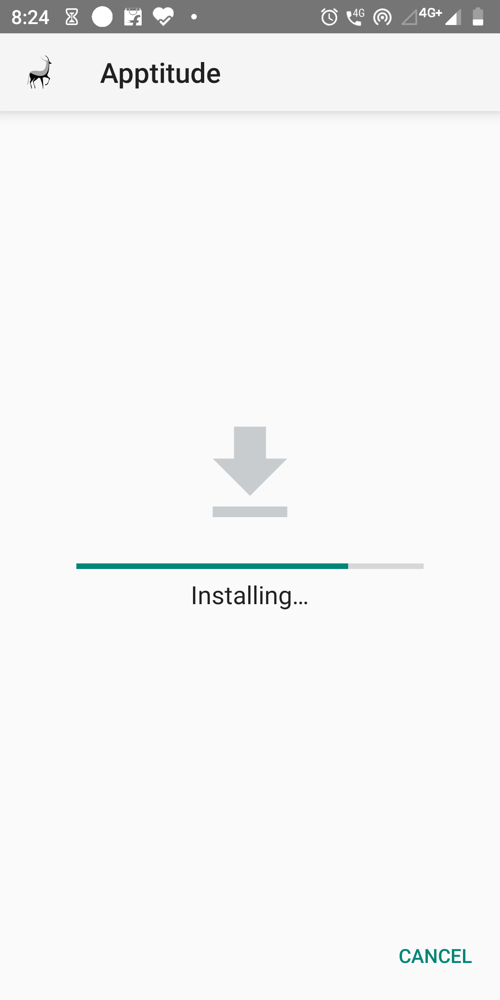
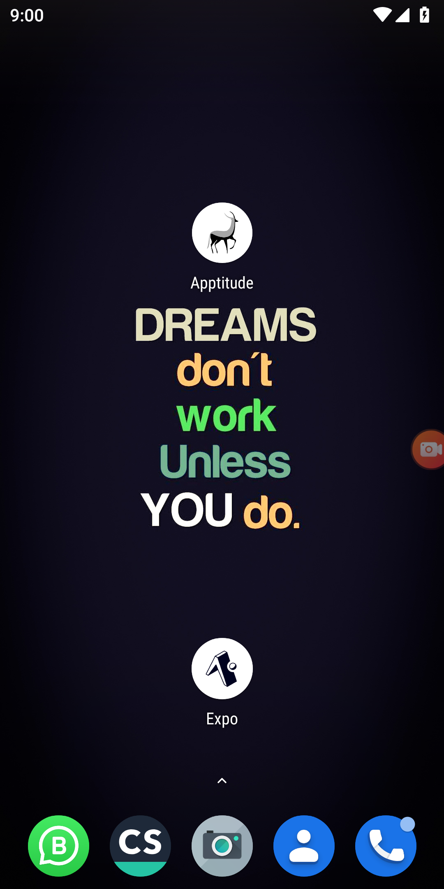
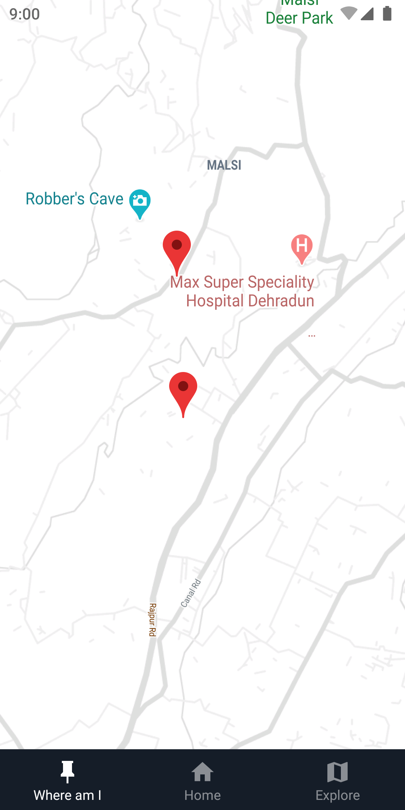
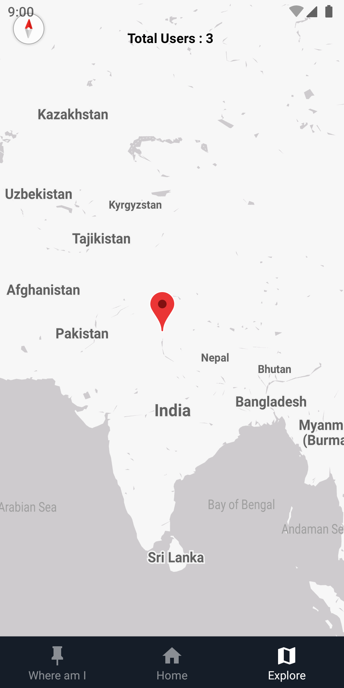

# Apptitude !

Video Demonstration

[**Download Now**](https://exp-shell-app-assets.s3.us-west-1.amazonaws.com/android/%40yashkumarverma/apptitude-eb4b9c2b856a4f178eed0bf478d67c35-signed.apk)

[**Video Demonstration**](https://www.youtube.com/watch?v=Oa3qXFARLDs)

## Features

- The application is divided into three screens. Home, LocateMe, and Explore.

**Home Screen**

- Gets user location by asking permissions
- Show current location coordinates
- Show current Location city, country and local area name on screen.
- Attractive background animation.
- Live location synced with **Firebase LiveDatabase** Service

**Where Am I**

- Where Am I page shows the current user location
- Full page view, covers the status bar also to give a rich feel browsing the map
- Map styled in a custom light theme to match UI
- All gestures working.
- Can see your current location, as well as YashKumarVerma's Location :)

**Explore**

- Shows live locations of all users
- Pointers of live users updated in real time as their location are updated
- Users that are offline are shown by their last seen location
- As new users open application, new pointers are added.
- Everything made realtime using Firebase

## Local Development

- Clone the repository
- Run `yarn install`
- Run `yarn start`

## Completion Status

All the requirements asked in the problem statement are met.

## Learning

- [x] Never Used Firebase, Used successfully.
- [x] Never used Maps. Used successfully.
- [x] Never used Location, Used successfully.

## Screenshots

All the screenshots are in the `screenshots` folder.

## Technologies Used

- [Firebase](http://firebase.google.com/)
- [Expo and allied packages](https://expo.io/)
- [React Native](https://reactnative.dev/)
- [Vector Icons](https://oblador.github.io/react-native-vector-icons/)

## License

- [MIT](https://choosealicense.com/licenses/mit/)
- All illustrations are original and created using Canva under Github Students Pack

## Author

- **Yash Kumar Verma**

  - LinkedIn: [yash-kumar-verma](https://www.linkedin.com/in/yash-kumar-verma/)
  - Stackoverflow: [yash-kumar-verma](https://stackoverflow.com/users/5131640/yash-kumar-verma?tab=profile)
  - 

